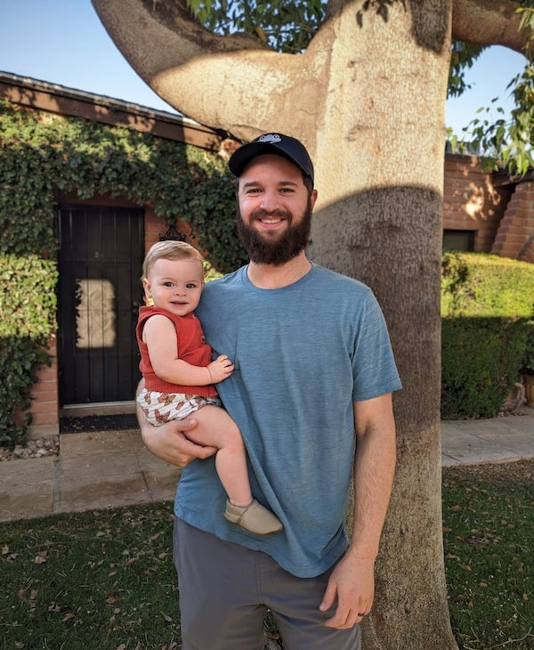



    I’m Jeff – a product designer and leader, specializing in building and scaling high-growth enterprise SaaS products and design teams.

    <svg class="w-full h-8" viewBox="0 0 3000 60" xmlns="http://www.w3.org/2000/svg" fill="none">
        <path d="M0 40 L100 0 L200 40 L300 0 L400 40 L500 0 L600 40 L700 0 L800 40 L900 0 L1000 40 L1100 0 L1200 40 L1300 0 L1400 40 L1500 0 L1600 40 L1700 0 L1800 40 L1900 0 L2000 40 L2100 0 L2200 40 L2300 0 L2400 40 L2500 0 L2600 40 L2700 0 L2800 40 L2900 0 L3000 40" 
              stroke="#047857" 
              stroke-width="12" 
              stroke-linecap="round" 
              stroke-linejoin="round"/>
    </svg>

    

    

    

        

        For most of my career, I've worked on SaaS products (with a little e-commerce sprinkled in) as an individual contributor, manager, and co-founder. I like to focus on establishing vision, standards, and good relationships. I enjoy learning about how people think and I use these learnings to guide product strategy as well as design experiences that support both the customer and the business.
        

        
I value collaboration, strive for trust, expect honesty, and believe in getting stuff done by putting people first. Some of the <a href="/work">work I've done</a> over the years includes feature team project work as an embedded designer, running discovery and research for improvement and zero-to-one projects, developing scalable and utility-driven design systems, growing and developing design teams through hiring and evangelism, establishing better design processes, and shaping design strategy and product vision.
        

        

        I'm currently based in Phoenix, AZ with my wife and daughter who both bring me an immense amount of joy. I hope this site gives you some insight into who I am, how I work, and what I can do. I put a lot of time, care, and learning into building it so I'm happy you were able to stop by.
        

        
I enjoy chatting about passions, experiences, the future, watches, keyboards, and more! <a href="mailto:hi@jefforshalick.com">Send me an email</a> to share something fun about yourself or just say hey.
        

        
    



<!-- I also have a passion for [designing & building architecture](/design-build/), especially when it comes to adaptive reuse; blending new building practices, materials, and technologies with existing buildings, structures, and environments.