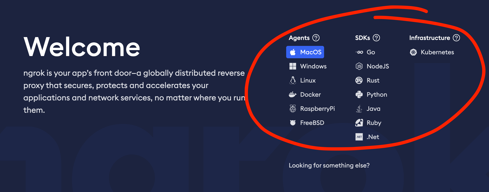
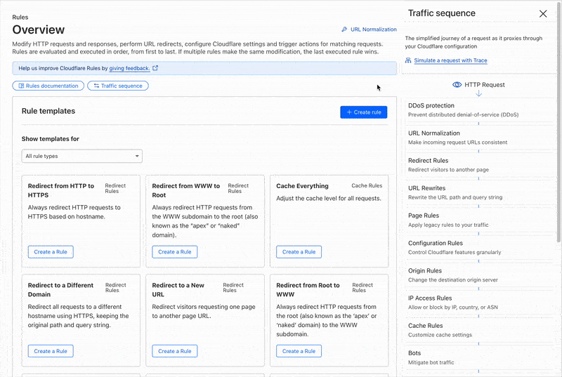
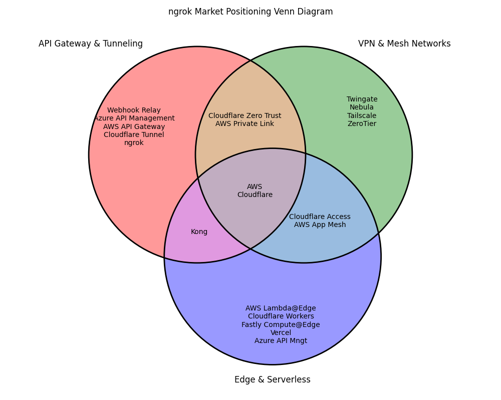


_Image from Raihan Nugroho Jauhari_

###### What does ngrok do?
[ngrok](https://ngrok.com/) provides a secure and scalable way to expose local services to the internet, enabling developers to create tunnels, manage network traffic, and integrate authentication, observability, and security features—all without complex networking configurations. It’s used for testing, API development, webhook handling, and enterprise-grade production deployments.

###### Coming at it from an outside perspective
I've worked with developers for the past 13 years, tinkering with web technologies for even longer, giving me a solid grasp of the space and its product offerings. After doing some market research such as reading blogs, technical docs, and review sites, I've compiled my thoughts below as conversation starters.



# Unlocking Growth Opportunities for ngrok

## **Understanding the Challenge**
ngrok has evolved from a simple command-line tool to a robust enterprise production orchestration product. While this transition has strengthened its enterprise presence, it presents growth challenges in positioning, education, and adoption—particularly in the mid-market segment.

By digging into user feedback, industry trends, and competitive dynamics, we can identify high-level opportunities for growth.

## **Key Areas to Explore**

### **1. Expanding Perception Beyond Tunneling**
**The Challenge:** Many users still associate ngrok **primarily with tunneling**, which limits its recognition as a **comprehensive networking solution**.

Products like NGINX have successfully expanded their perception beyond basic web servers to **load balancing, security, and API gateway solutions**. They achieved this through strategic content marketing, developer advocacy, and product bundles. Similarly, HashiCorp’s Consul started as a service discovery tool but evolved into a full-fledged service mesh, backed by a strong community presence and educational content.

The first landing experience in ngrok seems like a great opportunity to explain why different customers would want to use agents over SDK's over a Kubernetes implementation.

#### **Questions to Explore:**
- How can ngrok reposition itself **beyond tunneling** in user perception?
- What messaging and **product narratives** can clarify ngrok’s expanded capabilities?
- Are there **specific feature sets** that should be highlighted more prominently?

---

### **2. Reconnecting with the Mid-Market**
**The Gap:** As ngrok expands its enterprise capabilities, mid-market users could struggle with implementation due to knowledge gaps, missing education, documentation, **education, documentation, and onboarding**.

Many mid-market companies do not have dedicated DevOps or networking teams, making it crucial for ngrok to provide **clear, step-by-step onboarding resources** that help teams integrate the service without frustration. Competitors like Cloudflare have invested heavily in **developer-friendly guides** and interactive onboarding to ease this transition. For instance, Cloudflare’s “Getting Started” guide walks users through setup with video tutorials, CLI commands, and FAQs tailored for different use cases.

#### **Questions to Explore:**
- How can ngrok develop **targeted learning resources** to make adoption easier, and is the investment worth the cost?
- What improvements in **documentation** can help bridge the gap between CLI simplicity and enterprise complexity?
- Can a **guided onboarding experience** increase mid-market activation rates?

---

### **3. Balancing Technical Excellence with Accessibility**
**The Opportunity:** Despite being a highly technical product, **ngrok’s growth appears sales-led** rather than user or product-led, in other words, for many features, there is not a freemium offering to better communicate value before purchase.

Stripe is a prime example of balancing technical depth with ease of use. Their documentation is structured to **gradually introduce complexity**, ensuring that developers can start with basic payment APIs before exploring advanced integrations. Another example is Fly.io, which caters to developers by providing an intuitive UI while keeping command-line capabilities for power users.

#### **Questions to Explore:**
- How can **usability improvements** make ngrok more accessible without alienating technical users?
- What role does **developer experience** play in driving adoption and retention?
- Should ngrok invest in **self-serve tools and resources** to empower users?

---

### **4. Leaning Into Product-Led Growth for Scale**
**The Opportunity:** Many of ngrok’s competitors leverage **product-led growth (PLG)** as a key strategy, making it easier for users to discover, adopt, and expand their usage without a heavy reliance on direct sales.

Companies like Postman, Datadog, and Stripe have successfully driven growth by using **self-serve models**, **freemium offerings**, and **sandbox environments** that allow users to experience the value of the product before committing to a purchase.

As another example, Cloudflare uses pre-made rules and shows a traffic sequence diagram to both promote exploration and understanding, as well as better illustrate the potential use cases and features they offer.

On the other hand, even though [it's a year old](https://ngrok.com/blog-post/traffic-policy-engine), ngrok's traffic policy still requires a service upgrade to even see its capabilities in app. Leaning into freemium, or just showing the interface without the functionality available, could lead to more in-app conversions.

#### **Potential Strategies to Explore:**
- **In-Product Discovery:** Implement **contextual nudges and recommendations** to help users discover advanced features organically.
- **Freemium & Usage-Based Upselling:** Offer **limited free-tier access** to enterprise features, providing a clear upgrade path.
- **Self-Serve Sandboxes:** Create **interactive environments** where developers can explore advanced use cases with minimal friction.
- **Automated Expansion Loops:** Design workflows that encourage **team adoption**, similar to Slack’s viral growth model.

#### **Questions to Explore:**
- How can ngrok refine its **freemium model** to better convert users into paid customers?
- What in-product signals indicate **high-value accounts** that would benefit from premium features?
- How can **automated upsell triggers** reduce reliance on manual sales efforts and shorten the conversion cycle?
---

### **5. Addressing Mid-Market Security Concerns**
**The Challenge:** Mid-market companies require **secure remote access solutions** but lack dedicated security guidance.

Companies like ZeroTier and Tailscale emphasize security **without requiring extensive configuration**. Tailscale, for example, automatically encrypts all connections without manual key management. ngrok could **lean into simplified security configurations** that help mid-market users **comply with SOC 2, GDPR, and HIPAA** more easily (leaning into my governance, risk, and security background).

#### **Questions to Explore:**
- What **security features** are critical for mid-market adoption?
- How can ngrok support users with **compliance and regulatory needs**?
- Can a **security-first product narrative** reinforce trust?

---

### **6. Clarifying Product Roadmap & Vision**
**The Opportunity:** Users seek clearer insights into ngrok’s **long-term direction**.

Fastly and Cloudflare regularly publish **public roadmaps and developer updates**, fostering trust and engagement. Open-source projects like Kubernetes also thrive on **transparent development discussions**. ngrok could leverage similar tactics to **build stronger user confidence**.

#### **Questions to Explore:**
- How can ngrok provide **greater transparency** around product evolution?
- What engagement strategies can **involve the community** in roadmap discussions? For example, the current Github discussions page seems to have low user engagement.
- Should ngrok leverage **public changelogs or quarterly updates**?

---

## **Competitive Landscape: Current vs. Aspirational Positioning**
ngrok has historically been positioned as a **developer-first tunneling tool**, but as the product has matured, **aspirational competitors** now include broader networking and infrastructure platforms. Using the competitor comparison diagram, we can break down key insights:

### **Current ngrok Competitors**
- **Local tunneling tools** like Serveo and Localtunnel
- **Developer-focused access tools** such as Tailscale and ZeroTier
- **Simple networking utilities** used for testing and debugging

### **Aspirational Competitors** (Where ngrok may grow)
- **Full-scale API gateways** like NGINX and Kong
- **Networking and security solutions** like Cloudflare and Fastly
- **Infrastructure and observability platforms** such as HashiCorp Consul and Traefik



---

## **Conclusion: A Strategic Growth Roadmap**
To solidify its position as more than just a tunneling tool, ngrok could **expand its perception beyond tunneling** and clearly communicate its **broader networking and security capabilities**.

Addressing **mid-market adoption and security concerns** requires better **documentation, onboarding, and compliance features** to attract and retain users who need scalable solutions. 

A shift toward **product-led growth** will enable more seamless expansion through **in-product discovery, freemium models, and self-serve sandboxes**, reducing reliance on sales-led conversions. 

Finally, **balancing technical excellence with accessibility** and **clarifying the product roadmap** will ensure that ngrok is positioned for sustainable growth—empowering both individual developers and enterprise teams to integrate and scale with confidence.