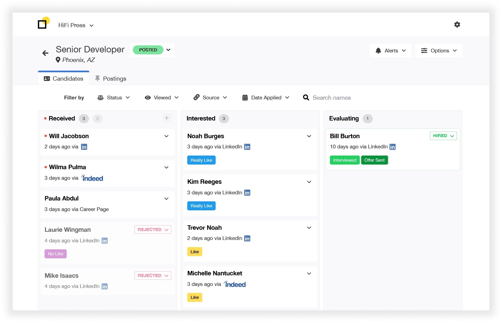
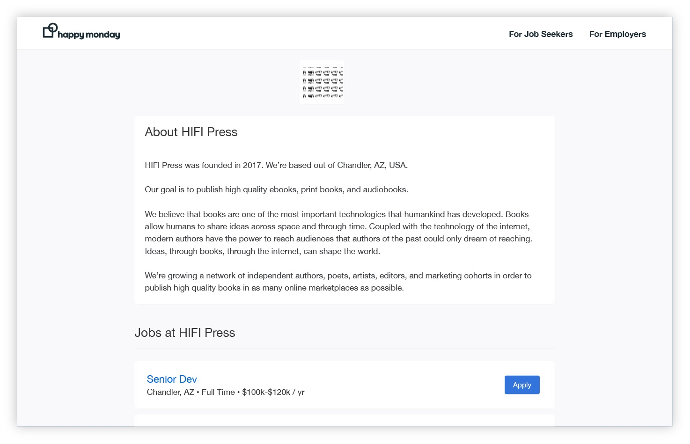
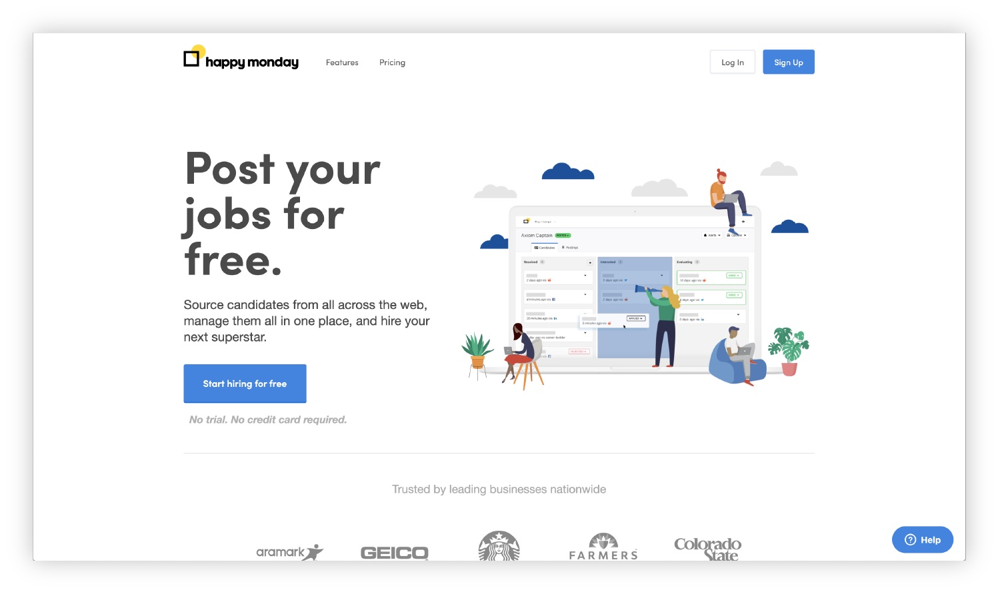
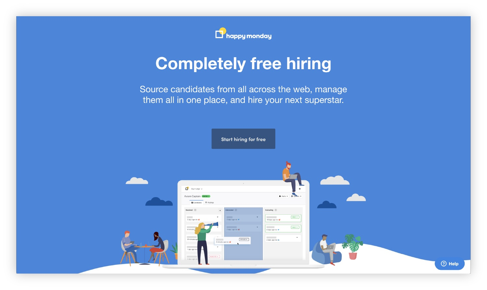

###### What the company does
Happy Monday helps match job seekers and employers in ways that looked beyond the resume.

###### My role & work
As a co-founder and designer, I worked on both our marketing site and our product. There were 3 of us to start and we grew the team up to 10 people.

###### Project timeline
We developed this company and product over the course of 2 years.



### Hiring Platform

### Growth design

