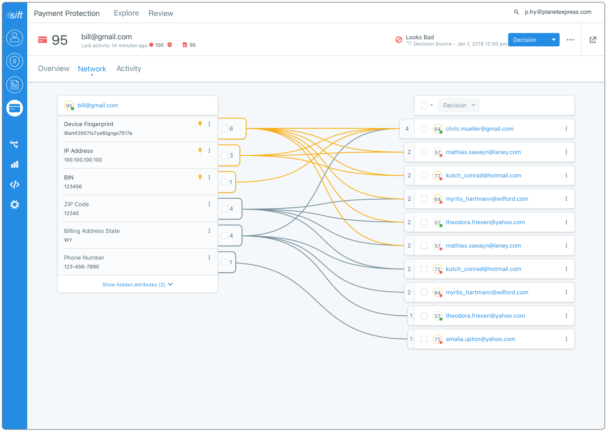
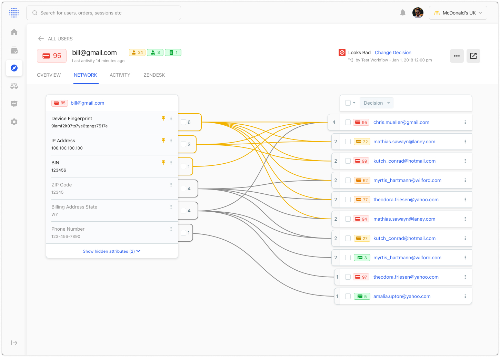

###### What the company does
[Sift](https://Sift.com/) helps companies monitor their customer networks and identify fraudulent activity.

###### Background
We had an aging network visualization feature that, in my research, I discovered was actually an extremely powerful tool that analysts use in their research to determine trustfulness of customer behavior.

###### My role & work
I led this project in planning, discovery, strategy, and design.

###### Teammates
1 Eng, 1PM

###### Project timeline
4 months from project inception to release



During this project, we were also in the middle of a pretty big overhaul of our design language. So I developed this design so that it worked across our current and future look and feel.  

### Current Look & Feel

### New Look & Feel

### Interactions
Here is a quick video showing some of the interactions and patterns zi designed into this page.

