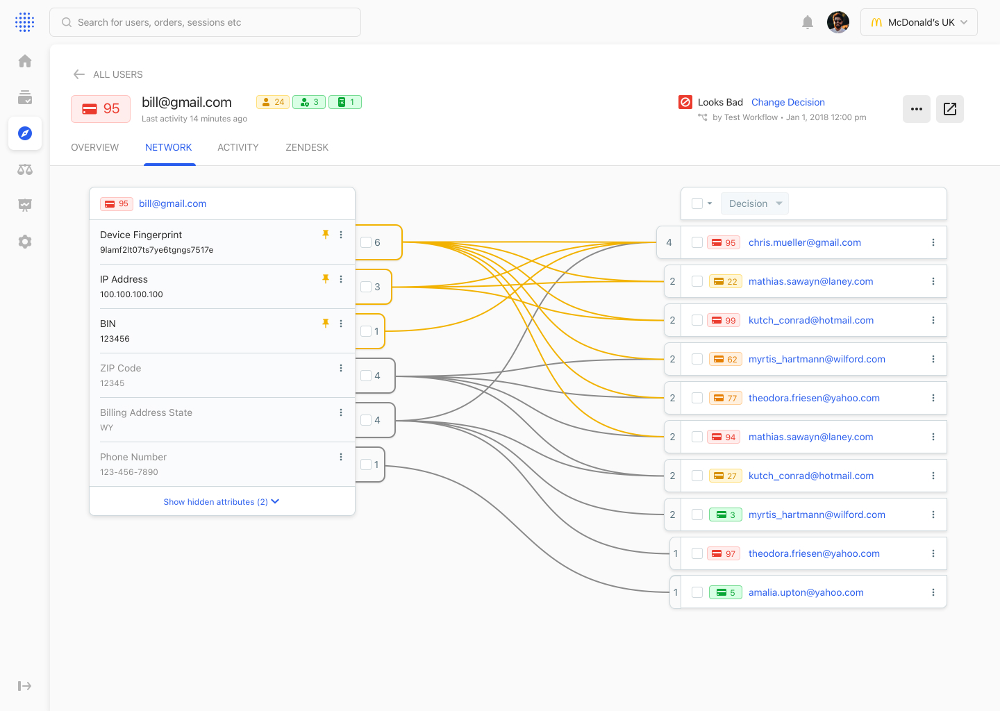

>[Sift](https://Sift.com/) helps companies monitor their customer networks and identify fraudulent activity.\
\
Our network visualizer had the potential to be an extremely useful tool in identifying relationships amongst fraudy actors but it hadn't been touched in years, leveraged unfamiliar patterns, and lacked some key features to be be truly usable and valuable.

\
I worked as a **full-stack designer** on this project; conducting discovery and research as well as crafting content and visual designs from lo-fi to hi-fi. I worked with a PM and a lead dev to bring this project to life.

