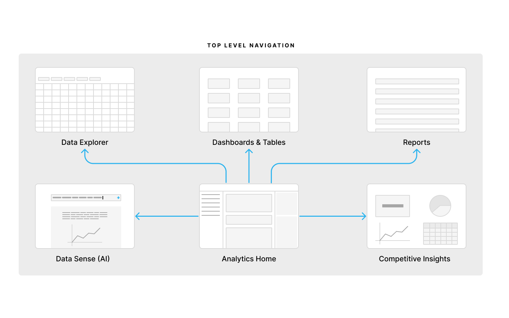



###### What the company does
[Reputation](https://reputation.com/) helps companies improve and stay on top of their online brand by helping manage business listing and review content across the web

###### Background
Reputation had been a sales driven organization for many years, building one-off and unscalable solutions without a cohesive product vision or plan, all while maintaining duplicative features from acquisitions.

###### My role & work
Design manager and head of UX design, leading the design team and establishing a clear, strategic, north star for our product & design

###### Teammates
Worked with leadership across engineering, product management, sales & sales engineering, customer support, and professional services

###### Project timeline
~2 month from idea to finalized plan to starting phase 1



## Framing Statements
### Feature/Eng Driven Development
Consolidate our backend to improve load times and speed up development.

### Improvement Story
We have a disjointed and hard to use platform.
We want a cohesive and easy to use product.

### Goal Problem Solution
To achieve the best offering for our customers,
We will address how difficult our platform is to use,
By focusing on product clarity, usability, and strategy.p

# Identifying gaps and measuring success

# Improvement Phases Overview
I came up with three phases to be used as checkpoints in this effort with the expectation of incremental improvements and releases throughout.

####  Phase 1 - Quick Wins
Focus on low to medium effort, big impact, improvements to the customer experience within our existing product and feature framework.
###### Focus Areas
- In-page navigation
- Expose & consolidate
high-value data
- Pilot analytics architecture
in social

#### Phase 2 - Rebalance
Use clear verbiage and leverage familiar mental models to quickly communicate value and guide customers to high-value pages and features.
###### Focus Areas
- Top level navigation
- Unified analytics
- Consistent brand experience
- Industry standard (familiar)
UI & Patterns

####  Phase 3 - Integration
Our platform feels like one experience in both UI and patterns, starts to leverage our platform advantage, and better supports cross-selling (PLG).
###### Focus Areas
- Shared components across Figma and code
- Linked data and flows
- Balance between customer asks and platform investment

## Phase 1 - Quick Wins
I came to this recommendation of quick wins from a list of over 300 customer and internal requests by talking with support, sales, and engineering to establish urgency and ease of fix. This work was to be done over the course of 2-3 months, slotting it into existing work.

## Phase 2 - Rebalance
This phase was planned to take 6-12 months until final release.

#### Navigation
As you can see, over time, our product navigation became a junk drawer of sorts. Our sales and pricing was all over the place with too many SKUs and different pricing models being used across our customers.

The goal here was to simplify our navigation by combining similar functionality and focusing on the goals of our customers.

#### Analytics
One area in particular that was strewn across our product was data analytics. Each feature team was responsible for part or all of their own analytics and there was no central place for our customers to answer their questions or explore data. This model below is the culmination of my work discussing strategies with PM and Engineering , finding out how to make it extensible and achievable, leveraging our existing technologies and implementations.

Something that was missing across our platform was a way to dig into the data. Even though we had the beginnings of a robust data analysis product, we didn't allow our customers to dig into the raw data when we displayed charts, trends, or recommendations. This model that I developed gave us the ability to leverage the data explorer as a raw data display tool across out platform, being able to be linked to from anywhere.

## Phase 3 - Integration
In this final phase, we will be building on the previous phase and the work to simplify pricing and packaging, navigation, and analytics within the platform. The timeline on this phase is a couple years out to design and then fully realize those designs.

Below, you can see how we extended the analytics experience and offeirng by retaining the new Data Explorer, Dashboards, and Reports pages but creating this new Analytics home space along with an LLM-driven data tool and rolling competitive insights into this space.

#### Answering our customers' questions
The impetus of this project was around quick fixes. However, I began to realize that this project was one of growth and transformation. I developed this list of questions to guide us in our future work.
1. How do people feel about my business?
2. What do people like and dislike about my business?
3. How does this perception affect my online presence?
4. How does the perception of my business and online presence affect my business’s bottom line?
5. Does my online presence attract and retain customers?
6. What can I do to improve my customer perception?
7. Which customers need responding to?
8. What should I do in the Reputation platform?

Using these questions, I wireframed some ideas that would allow us to excel in brand, sales, product clarity, and ease of use. Below is supposed to drive our efforts towards this goal.

And here are some of the products with their associated navigation. You can start to see where the connection and separation between the products start to form. Much of this was driven by how our customers currently use our software as well as where I thought our business was going.

## Conclusion
As I mentioned above, while this project started out as an effort to identify quick fixes, I realized that we as a product organization were missing a shared understating of where we were going. I developed this plan as a way to both give us action items in the short term and to start conversations about the future. We have started working on the quick wins and are now having conversations about the future of our product. I'd call this a success and am excited to be able to measure results, customer sentiment, and build for the future.

