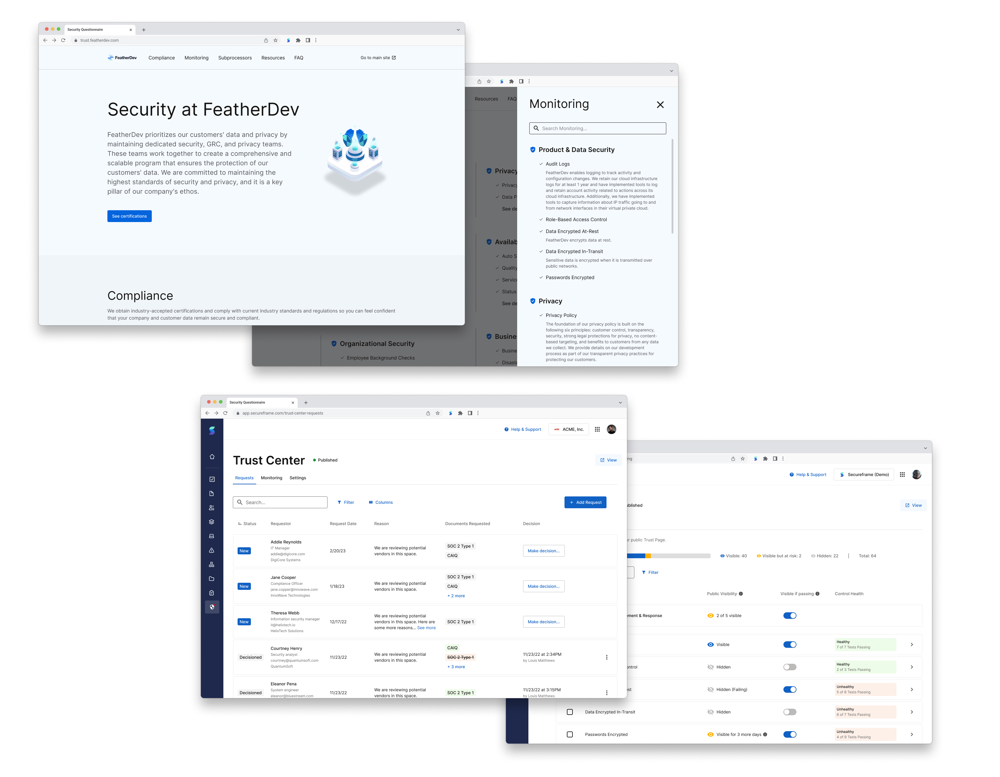

>[Secureframe](https://secureframe.com/) helps streamline compliance efforts across different compliance frameworks including SOC 2, ISO 27001, and HIPAA.\
\
We noticed that we were losing quite a few deals to our competition because we didn't offer any type of way for our customers to publicly display their compliance stance. So, in order to stay competitive in the space, we needed to build a product that is generally known as a Trust Center.

\
My role on this project was that of a **full-stack designer**; conducting discovery and research as well as crafting content and visual designs from lo-fi to hi-fi. My direct team was composed of a PM and a group of engineers.

---
## Understanding the why and what
We noticed that we kep losing deals to our competitors when it was down to us and another compliance platform. We dug in and noticed that a key feature that we were missing and that our competition had was a way for our customers to publish their compliance achievements and stance. One of our very direct competitors, [Vanta](https://www.vanta.com/), even purchased a fairly prominent player in the space, [Trustpage](https://trustpage.com/), while we were building an offering of our own. This validated our efforts in trying to stay competitive in the marketplace.

## The pieces of the puzzle
In order for this product to be successful, we needed to make sure we had all the pieces, even for our MVP release:
1. Admin to manage public trust center and document requests  
2. Public trust center
3. Ability to request documents on the public trust center

### Competition and considerations
In 
